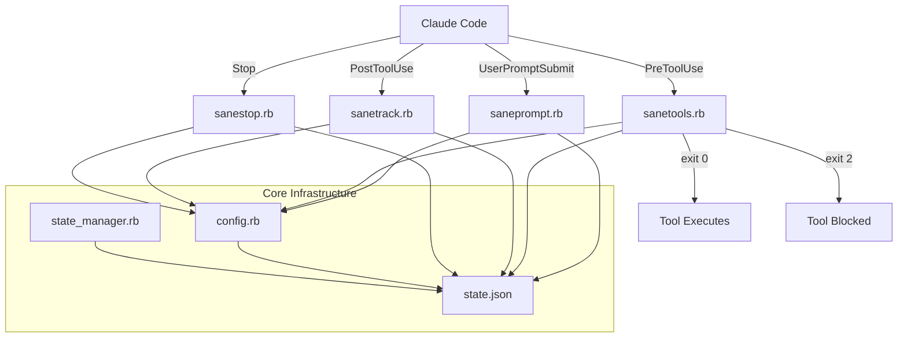
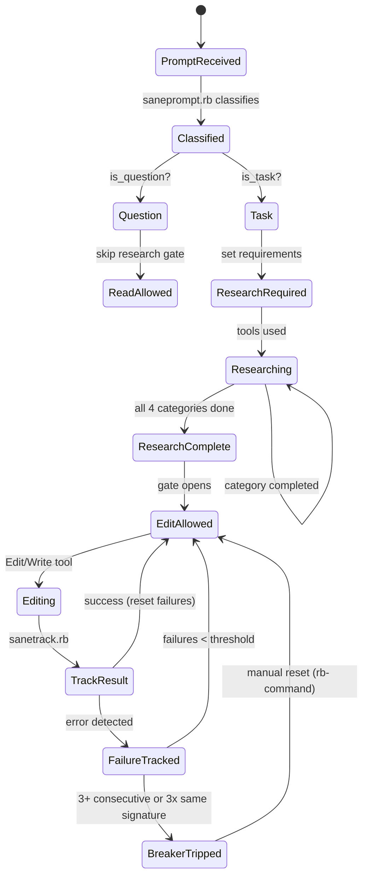
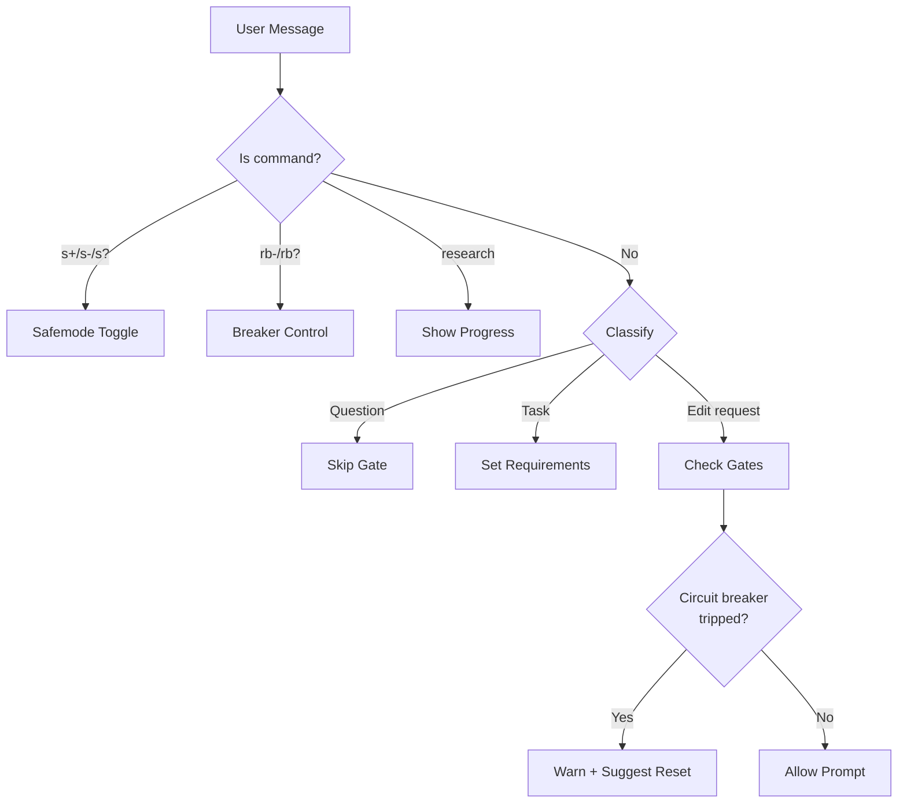
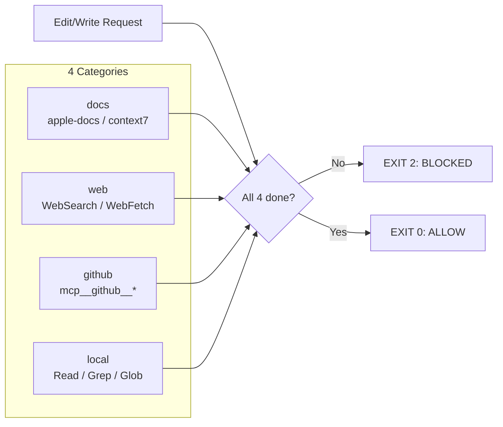
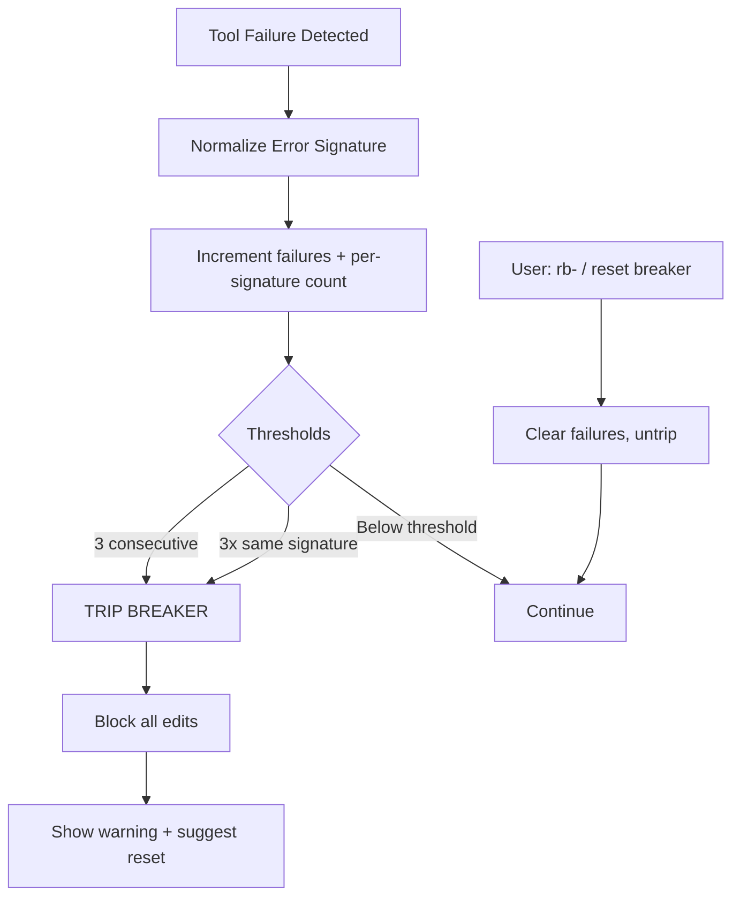
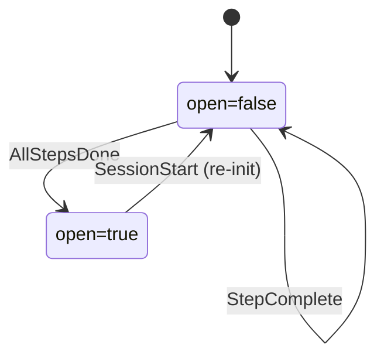

# SaneProcess Architecture

> [README](README.md) · [DEVELOPMENT](DEVELOPMENT.md) · [ARCHITECTURE](ARCHITECTURE.md)

How the enforcement system works, why decisions were made, and where it's headed.

---

## 1. System Overview

SaneProcess is a hook-based enforcement framework for Claude Code that implements the scientific method as a development workflow. Four Ruby hooks intercept Claude Code events (prompt submission, tool calls, tool results, session end), enforce research-before-edit discipline through a 4-category research gate (docs, web, github, local), and prevent doom loops via a circuit breaker pattern. All state lives in a single HMAC-signed JSON file.

### Component Diagram



### Entry Points

| Hook Type | Script | When | Exit Codes |
|-----------|--------|------|------------|
| UserPromptSubmit | saneprompt.rb | User sends message | 0=allow |
| PreToolUse | sanetools.rb | Before tool executes | 0=allow, 2=block |
| PostToolUse | sanetrack.rb | After tool completes | 0=always |
| Stop | sanestop.rb | Session ends | 0=allow |

### Core Modules

```
scripts/hooks/core/
├── config.rb         # Paths, thresholds, settings
└── state_manager.rb  # Read/write state.json (HMAC-signed, file-locked)
```

- **config.rb** — Single source for all configuration: project paths, state file location, bypass detection, circuit breaker threshold (3), file size limits (500 warn / 800 block), blocked system paths.
- **state_manager.rb** — All state in one signed JSON file. API: `get(:section, :key)`, `set(:section, :key, value)`, `update(:section) { |s| s }`, `reset(:section)`. File locking for concurrent access. HMAC signing for tamper detection.

### File Locations

```
.claude/
├── state.json           # All hook state (signed)
├── state.json.lock      # File lock
├── bypass_active.json   # Safemode marker (exists = active)
├── saneprompt.log       # Prompt hook log
├── sanetools.log        # Tools hook log
├── sanetrack.log        # Track hook log
├── sanestop.log         # Stop hook log
└── audit.jsonl          # Audit log
```

---

## 2. State Machines

### Enforcement State Machine

The main enforcement lifecycle: from user prompt through research gate to edit permission.



### Prompt Classification Flow



### Research Gate

Before any edit (Edit, Write, Bash with mutation) is allowed, 4 research categories must be satisfied:



### Circuit Breaker Flow



### Startup Gate Flow

Blocks substantive work until mandatory startup steps are complete. Initialized in `session_start.rb`, tracked in `sanetrack_gate.rb`, and enforced in `sanetools_startup.rb`.



Startup steps tracked:
- `session_docs` (read required docs)
- `skills_registry` (read `~/.claude/SKILLS_REGISTRY.md`)
- `validation_report` (run `scripts/validation_report.rb`)
- `orphan_cleanup` (kill orphaned Claude processes)
- `system_clean` (run `./scripts/SaneMaster.rb clean_system`)

### Deployment Safety Flow

Tracks Sparkle signing and stapler verification to block unsafe deploy actions.

```mermaid
flowchart TD
    SIGN[sign_update(.swift) DMG] --> REC_SIGN[Record sparkle_signed_dmgs]
    STAPLE[xcrun stapler validate/staple] --> REC_STAPLE[Record staple_verified_dmgs]

    REC_SIGN --> READY{Signed?}
    REC_STAPLE --> READY
    READY -->|yes| UPLOAD[wrangler r2 object put]
    READY -->|no| BLOCK_UPLOAD[BLOCK: missing signature/staple]

    APPCAST[Edit appcast.xml] --> CHECK_SIG{edSignature valid?}
    CHECK_SIG -->|no| BLOCK_APPCAST[BLOCK: empty/placeholder/gh url/length mismatch]
```

### Tool Categorization (Blast Radius)

| Category | Examples | Blocked Until |
|----------|----------|---------------|
| Read-only | Read, Grep, Glob, search | Never blocked |
| Local mutation | Edit, Write | Research complete |
| Sensitive files | CI/CD, entitlements, .xcconfig, Fastfile | Confirmed once per file per session |
| External mutation | GitHub push | Research complete |

### State Schema

```json
{
  "circuit_breaker": {
    "failures": 0,
    "tripped": false,
    "tripped_at": null,
    "last_error": null,
    "error_signatures": {}
  },
  "requirements": {
    "requested": [],
    "satisfied": [],
    "is_task": false,
    "is_big_task": false,
    "is_research_only": false
  },
  "research": {
    "docs": null,
    "web": null,
    "github": null,
    "local": null
  },
  "edits": {
    "count": 0,
    "unique_files": [],
    "last_file": null
  },
  "saneloop": {
    "active": false,
    "task": null,
    "iteration": 0,
    "max_iterations": 20,
    "acceptance_criteria": [],
    "started_at": null
  },
  "enforcement": {
    "blocks": [],
    "halted": false,
    "halted_at": null,
    "halted_reason": null,
    "session_started_at": null
  },
  "edit_attempts": {
    "count": 0,
    "last_attempt": null,
    "reset_at": null
  },
  "sensitive_approvals": {},
  "startup_gate": {
    "open": false,
    "opened_at": null,
    "steps": {
      "session_docs": false,
      "skills_registry": false,
      "validation_report": false,
      "orphan_cleanup": false,
      "system_clean": false
    },
    "step_timestamps": {}
  },
  "deployment": {
    "sparkle_signed_dmgs": [],
    "staple_verified_dmgs": []
  },
  "action_log": [],
  "reminders": {},
  "learnings": [],
  "patterns": {
    "weak_spots": {},
    "triggers": {},
    "strengths": [],
    "session_scores": []
  },
  "validation": {
    "sessions_total": 0,
    "sessions_with_tests_passing": 0,
    "sessions_with_breaker_trip": 0,
    "blocks_that_were_correct": 0,
    "blocks_that_were_wrong": 0,
    "doom_loops_caught": 0,
    "doom_loops_missed": 0,
    "time_saved_estimates": [],
    "first_tracked": null,
    "last_updated": null
  },
  "mcp_health": {
    "verified_this_session": false,
    "last_verified": null,
    "mcps": {
      "apple_docs": { "verified": false, "last_success": null, "failure_count": 0 },
      "context7": { "verified": false, "last_success": null, "failure_count": 0 },
      "github": { "verified": false, "last_success": null, "failure_count": 0 }
    }
  },
  "refusal_tracking": {},
  "task_context": {
    "task_type": null,
    "task_keywords": [],
    "task_hash": null,
    "researched_at": null
  },
  "session_docs": {
    "required": [],
    "read": [],
    "enforced": true
  },
  "verification": {
    "tests_run": false,
    "verification_run": false,
    "last_test_at": null,
    "test_commands": [],
    "edits_before_test": 0
  },
  "planning": {
    "required": false,
    "plan_shown": false,
    "plan_approved": false,
    "replan_count": 0,
    "forced_at": null
  },
  "skill": {
    "required": null,
    "invoked": false,
    "invoked_at": null,
    "subagents_spawned": 0,
    "files_read": [],
    "satisfied": false,
    "satisfaction_reason": null
  }
}
```

### Concurrency Model

**Single-writer, file-locked state:**
- All hooks read/write `state.json` through `StateManager`
- File locking (`state.json.lock`) prevents concurrent writes
- Hooks execute sequentially per Claude Code event — no parallel hook execution
- HMAC signing prevents external tampering with state

**Race condition mitigations:**
- `StateManager.update(:section)` does atomic read-modify-write under lock
- If lock acquisition fails, hook fails safe (exit 0, allows tool)
- PostToolUse (sanetrack) and PreToolUse (sanetools) never run simultaneously for the same tool call

### User Commands

| Command | Hook | Effect |
|---------|------|--------|
| `s+` | saneprompt | Enable safemode (blocks all edits) |
| `s-` | saneprompt | Disable safemode |
| `s?` | saneprompt | Show safemode status |
| `rb-` / `rb+` / `reset breaker` | saneprompt | Reset circuit breaker |
| `rb?` / `breaker status` | saneprompt | Show breaker status |
| `research` | saneprompt | Show research progress |

### Design Principles

1. **One state file** — No scattered JSON files
2. **Exit codes matter** — 0 allow, 2 block
3. **Fail safe** — On error, allow (don't block randomly)
4. **Self-testable** — Every hook has `--self-test`
5. **Centralized config** — All paths in Config module
6. **Text ≠ Error** — Check explicit error fields, not content

---

## 3. Architecture Decisions

### ADR-001: Consolidate from 23 hooks to 4 (2026-01-04)

**Context:** The original hook system had 23 files (~4,260 lines) with significant duplication: circuit breaker logic in 3 files, research tracking in 2 files, SaneLoop enforcement in 3 files, edit counting in 5 files, bypass checking in 5 files. `process_enforcer.rb` alone was 924 lines. 15+ separate state files made reasoning difficult.

**Options:**
1. Keep granular hooks, fix duplication
2. Consolidate into 4 event-driven hooks with shared core
3. Registry/coordinator pattern (detector → decision → action pipeline)

**Decision:** Option 2 — consolidate into 4 hooks (saneprompt, sanetools, sanetrack, sanestop) with shared `core/` modules. The registry pattern (Option 3) was designed but deferred as premature — `hook_registry.rb` and `coordinator.rb` exist as stubs.

**Rationale:**
- Industry patterns (pre-commit, ESLint, Husky) all use centralized state + separation of concerns
- 4 hooks maps 1:1 to Claude Code's 4 event types
- Single state file eliminates 15 scattered JSON files
- File locking + HMAC signing solved both concurrency and tampering
- Result: every file under 500 lines, single state file, all detectors testable

### ADR-002: SanePrompt orchestration design (2026-01-04)

**Context:** Claude Code needed a system to transform vague user prompts into structured, research-gated execution plans with explicit rule mapping.

**Decision:** Designed a multi-phase orchestration: prompt → classification → research burst → execution → checkpoint → summary. Execution modes: Autonomous, Phase-by-phase (default), Supervised, Modify plan.

**Key design choices:**
- 4-category parallel research burst before any edits
- Rule mapping baked into classification (bug fix → #8, #7, #4, #3; new feature → #0, #2, #9, #5)
- Gaming detection: rating inflation (5+ consecutive 8+/10), bypass creation, research skipping, rule citation without evidence
- Passthrough patterns for commands (`/commit`, `yes`, `continue`) skip transformation
- Frustration detection: ALL CAPS, repeated instructions, "read the prompt" trigger re-read

**Status:** Core classification shipped in saneprompt.rb. Advanced orchestration (phase runner, gaming detector, clarifier) designed but not implemented — the hook-based enforcement catches the same issues.

### ADR-003: Hook matcher wildcard limitation (2026-01-04)

**Context:** MCP tools (e.g., `mcp__github__push_files`) bypass all enforcement because hook matchers require exact tool names. Any enforcement layer built with hooks has a fundamental bypass via dynamically-named MCP tools.

**Decision:** Filed feature request with Anthropic for wildcard/pattern matching in hook matchers. Workaround: explicit matchers for known MCP tools (maintenance burden, incomplete coverage).

**Proposed solutions:**
1. Glob-style wildcards: `"matcher": "mcp__*"`
2. Catch-all: `"matcher": "*"`
3. Regex: `"matcher": "/^mcp__/"`

**Status:** Request filed. Workaround (explicit matchers) in use.

---

## 4. Landscape

### Comparison

| Tool | Enforcement | Orphan Cleanup | Circuit Breaker | Research Gate | Signed State | Tests |
|------|:-:|:-:|:-:|:-:|:-:|:-:|
| **SaneProcess** | Hooks | Yes | Yes | Yes | HMAC | 412 |
| CLAUDE.md rules | Suggestions only | — | — | — | — | — |
| .cursorrules | Suggestions only | — | — | — | — | — |
| [rulesync](https://github.com/dyoshikawa/rulesync) | File sync | — | — | — | — | — |

**Key differentiators:**
- Circuit breaker (unique in Claude Code ecosystem)
- Research gate (4-category verification before edits)
- HMAC-signed state (tamper detection)
- Orphan process cleanup (sessions, MCP daemons, subagents)

### References

- [Anthropic - Claude Code Best Practices](https://www.anthropic.com/engineering/claude-code-best-practices)
- [steipete/agent-scripts](https://github.com/steipete/agent-scripts) — skills library inspiration

---

## 5. Error Handling & Security

### Error Matrix

| Error | Source | Severity | Recovery |
|-------|--------|----------|----------|
| JSON parse failure (stdin) | Hook input | Low | Fail safe: exit 0 (allow tool) |
| State file corrupted/missing | state.json | Medium | Reset to defaults, log warning |
| HMAC signature mismatch | state.json | High | Reset state, log tamper attempt |
| File lock timeout | state.json.lock | Medium | Fail safe: exit 0 |
| Hook script syntax error | Any hook | High | Fail safe: `|| true` in settings.json |
| Circuit breaker false positive | sanetrack | Medium | Manual reset via `rb-` command |

### Security Model

**Threats addressed:**
- **State tampering:** HMAC signing on state.json detects manual edits
- **HMAC key protection:** Secret stored in macOS Keychain (not file-readable by agent tools)
- **Research gate bypass:** Only PostToolUse (sanetrack) can mark research categories complete
- **Path traversal:** Blocked system paths (`.ssh`, `.aws`, `/etc`)
- **Edit without research:** PreToolUse blocks mutations until gate satisfied
- **Inline script detection:** `python -c`, `ruby -e`, `node -e`, `perl -e` blocked as bash mutations
- **Doom loops:** Circuit breaker trips after 3 consecutive failures

**Known gaps:**
- MCP tools can bypass enforcement (no wildcard matcher support — see ADR-004)
- State file can be deleted (hook fails safe, re-creates with defaults)
- `|| true` in settings.json means broken hooks silently pass

### Exit Codes

| Code | Meaning | Effect |
|------|---------|--------|
| 0 | Allow | Tool proceeds |
| 1 | Warning (deprecated) | Tool proceeds |
| 2 | Block | Tool prevented |

---

## 6. Dependencies & External APIs

| Dependency | Version | Purpose | Risk |
|------------|---------|---------|------|
| Ruby 3.x | Homebrew / system | Hook execution | `brew install ruby` on macOS |
| Claude Code | Latest | Host platform | Breaking changes to hook API |
| JSON (stdlib) | Ruby stdlib | State parsing | None |
| OpenSSL (stdlib) | Ruby stdlib | HMAC signing | None |
| MCP servers | Various | Research tools | Network dependency |

### MCP Servers (Optional)

The research gate works best with MCP servers that provide documentation and code search. None are required — if an MCP isn't available, its research category auto-completes.

Recommended:
- **context7** — Library documentation lookup
- **github** — External code search
- **apple-docs** — Apple SDK verification (Swift projects)

### Download Analytics (sane-dist Worker)

The `sane-dist` Cloudflare Worker serves app downloads (DMG/ZIP) from a shared R2 bucket across all `dist.{app}.com` domains. Download analytics use a D1 database (`sane-dist-analytics`) for privacy-first, daily-aggregate counting.

**How it works:**
1. Every successful file download triggers `logDownload()` via `ctx.waitUntil()` (non-blocking)
2. D1 UPSERT increments daily count per unique `(app, version, mode, source, date)` tuple
3. Source detection from User-Agent: `Sparkle/*` → sparkle, `Homebrew/*` → homebrew, other → website, empty → unknown
4. No personal data stored (no IPs, no cookies, no fingerprints)
5. Analytics failures are silently swallowed — D1 outage never breaks downloads

**Endpoints:**
- `GET /api/stats?days=30&app=sanebar` — Requires `Authorization: Bearer <ANALYTICS_API_KEY>`. Returns JSON with totals, by_source, by_app, and raw rows.

**CLI access:**
- `SaneMaster.rb downloads` (alias: `dl`) — calls `scripts/automation/dl-report.py`
- Flags: `--daily`, `--days N`, `--app NAME`, `--json`

**D1 database:** `sane-dist-analytics` (ID: `c1a9df59-650b-4ffe-9f80-83439d8e9e13`, region: ENAM)
**API key:** Stored as Wrangler secret `ANALYTICS_API_KEY` and in macOS keychain as `dist-analytics`/`api_key`.

### Daily Report (`morning-report.sh`)

Automated daily business report covering revenue, downloads, traffic, GitHub, customer intel, and system health. Runs once daily at 7pm EST via LaunchAgent.

**LaunchAgent:** `~/Library/LaunchAgents/com.saneapps.daily-report.plist`
- Label: `com.saneapps.daily-report`
- Schedule: `StartCalendarInterval` Hour=19 (7pm local time)
- Logs: `outputs/daily_report_cron.log`

**Script:** `scripts/automation/morning-report.sh`

**Report sections (in order):**
1. **Executive Summary** — 2-line AI-generated overview (via `nv`, 60s timeout)
2. **Revenue** — LemonSqueezy sales (today/yesterday/week/all-time) + GitHub Sponsors
3. **Downloads** — From `dl-report.py` calling the sane-dist `/api/stats` endpoint (7-day window, by-app and by-version breakdowns)
4. **Website Traffic** — Cloudflare analytics per domain (7-day views/uniques)
5. **GitHub** — Stars, forks, clones, views per repo; open issues; referrer sources
6. **Customer Intel** — Pending emails (count + top 5) and high-priority bugs (top 5)
7. **Health** — API connectivity checks (LemonSqueezy, Cloudflare, GitHub, dist workers, checkout). One line when all OK.
8. **Git Status** — Last commit date and clean/dirty status per app repo

**Environment & API keys:**
- All keys loaded from `~/.config/nv/env` (keychain is inaccessible in headless LaunchAgent context)
- Required keys: `GITHUB_TOKEN`, `LEMONSQUEEZY_API_KEY`, `CLOUDFLARE_API_TOKEN`, `RESEND_API_KEY`, `DIST_ANALYTICS_KEY`, `NV_API_KEY`
- File permissions: 600

**Reliability features:**
- `safe_curl` wrapper enforces timeouts on all HTTP calls (10s connect, 30s max)
- `timeout 60` on `nv` CLI calls (AI summary generation)
- Lock file with 30-minute stale detection prevents overlapping runs
- All analytics/AI failures are non-fatal — report always generates
- Archive copy saved to `outputs/reports/YYYY-MM-DD.md` before overwriting

**Output:** `outputs/morning_report.md` (latest) + `outputs/reports/` (archive)

---

## 7. Test Coverage Map

| Component | Self-Test | Tier Tests | Total |
|-----------|----------|------------|-------|
| saneprompt.rb | 176 | 62 | 238 |
| sanetools.rb | 25 | 66 | 91 |
| sanetrack.rb | 23 | 37 | 60 |
| sanestop.rb | 17 | 5 | 22 |
| Integration | — | 5 | 5 |
| **Total** | **241** | **175** | **416** |

### Running Tests

```bash
# Self-tests (per hook)
ruby scripts/hooks/saneprompt.rb --self-test
ruby scripts/hooks/sanetools.rb --self-test
ruby scripts/hooks/sanetrack.rb --self-test
ruby scripts/hooks/sanestop.rb --self-test
ruby scripts/hooks/core/config.rb --self-test

# Tier tests (all enforcement scenarios)
ruby scripts/hooks/test/tier_tests.rb
ruby scripts/hooks/test/tier_tests.rb --tier easy
ruby scripts/hooks/test/tier_tests.rb --tier hard
ruby scripts/hooks/test/tier_tests.rb --tier villain
```
