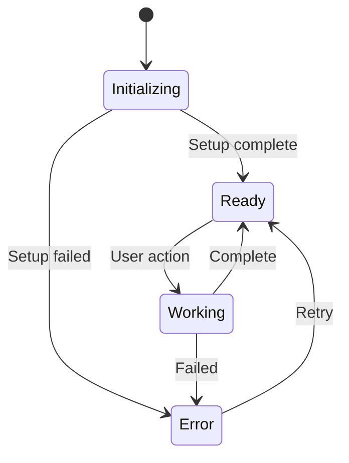
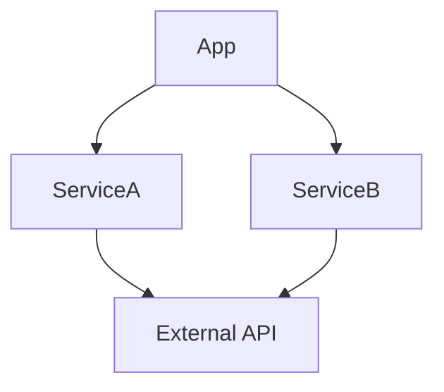

# [ProjectName] Research Document

> **Single source of truth for project research, architecture, and state machines.**
> Created: YYYY-MM-DD

---

## 1. Problem Statement

### What problem does this solve?
[Brief description of the user problem]

### Who is the target user?
[User persona and use case]

### Success criteria
- [ ] Criterion 1
- [ ] Criterion 2

---

## 2. Competitive Analysis

| App | Strengths | Weaknesses | Price |
|-----|-----------|------------|-------|
| Competitor 1 | | | |
| Competitor 2 | | | |

### Our differentiation
[What makes this better/different]

---

## 3. Technical Research

### 3.1 Platform APIs

| API | Framework | Min OS | Verified |
|-----|-----------|--------|----------|
| Example API | ExampleKit | macOS 14 | [ ] |

**Verification sources:**
- [ ] Apple docs: [link]
- [ ] WWDC session: [link]
- [ ] Sample code: [link]

### 3.2 Dependencies

| Package | Version | Purpose | License |
|---------|---------|---------|---------|
| Sparkle | 2.6.0 | Auto-updates | MIT |

### 3.3 Entitlements Required

| Entitlement | Reason |
|-------------|--------|
| `com.apple.security.app-sandbox` | App Store requirement |

---

## 4. Architecture Decisions

### 4.1 Pattern: [Decision Name]

**Context:** [Why this decision was needed]

**Options considered:**
1. Option A - [pros/cons]
2. Option B - [pros/cons]

**Decision:** Option X

**Rationale:** [Why this option]

---

## 5. State Machine Documentation

### 5.1 Main Application State

### 5.2 State Details

| State | Entry Action | Exit Action | Invariants |
|-------|--------------|-------------|------------|
| Initializing | Load config | - | Config file exists |
| Ready | Enable UI | Disable UI | Services running |
| Working | Show progress | Hide progress | Task in flight |
| Error | Log error | Clear error | Error captured |

### 5.3 Transitions

| From | To | Trigger | Guard | Action |
|------|-----|---------|-------|--------|
| Initializing | Ready | Setup complete | Config valid | Start services |
| Ready | Working | User clicks | Not already working | Begin task |

### 5.4 Sub-State Machines

[Document any nested state machines for complex components]

### 5.5 Service Dependencies

### 5.6 Concurrency Model

| Component | Thread | Isolation | Notes |
|-----------|--------|-----------|-------|
| UI | Main | @MainActor | All UI updates |
| Network | Background | actor | Isolated state |
| Database | Background | actor | Serial access |

**Potential races:**
1. [Describe race condition 1]
2. [Describe race condition 2]

**Mitigations:**
1. [How race 1 is prevented]
2. [How race 2 is prevented]

### 5.7 Error Handling Matrix

| Error | Source | Recovery | User Message |
|-------|--------|----------|--------------|
| Network timeout | API call | Retry 3x | "Connection lost" |
| Permission denied | System | Show settings | "Enable in Privacy" |

### 5.8 Notifications & Events

| Event | Publisher | Subscribers | Payload |
|-------|-----------|-------------|---------|
| ConfigChanged | SettingsService | UI, Workers | Config object |

### 5.9 External API Calls

| Endpoint | Method | Auth | Rate Limit |
|----------|--------|------|------------|
| /api/v1/items | GET | Bearer | 100/min |

### 5.10 Entry/Exit Actions

[Already covered in State Details table above]

### 5.11 Invariants

| Invariant | Checked By | On Violation |
|-----------|------------|--------------|
| User must be authenticated | AuthService | Redirect to login |
| Config must be valid | ConfigService | Show error + defaults |

### 5.12 Security Considerations

| Threat | Mitigation |
|--------|------------|
| Credential exposure | Keychain storage |
| Path traversal | Input validation |

### 5.13 Test Coverage Checklist

| State/Transition | Unit Test | Integration Test |
|------------------|-----------|------------------|
| Initializing → Ready | [ ] | [ ] |
| Ready → Working | [ ] | [ ] |
| Working → Error | [ ] | [ ] |
| Error recovery | [ ] | [ ] |

---

## 6. UI/UX Research

### 6.1 Semiotics Analysis

| Element | Signifier | Signified | User Expectation |
|---------|-----------|-----------|------------------|
| Green checkmark | Success | Action completed | Safe to proceed |
| Red X | Error | Something wrong | Need attention |

### 6.2 Accessibility Requirements

- [ ] VoiceOver labels for all interactive elements
- [ ] Keyboard navigation support
- [ ] High contrast mode support
- [ ] Motion reduction respected

### 6.3 Accessibility Identifiers

| Element | Identifier | Purpose |
|---------|------------|---------|
| Main window | `mainWindow` | UI testing |
| Save button | `saveButton` | UI testing |

---

## 7. File & Data Locations

| Data | Location | Backup |
|------|----------|--------|
| User config | `~/Library/Application Support/[App]/` | iCloud |
| Cache | `~/Library/Caches/[App]/` | No |
| Logs | `~/Library/Logs/[App]/` | No |

---

## 8. Open Questions

- [ ] Question 1: [Details]
- [ ] Question 2: [Details]

---

## 9. Research Sources

### MCP Tools Used
- [ ] apple-docs: [queries made]
- [ ] context7: [libraries checked]
- [ ] github: [repos searched]
- [ ] memory: [past learnings reviewed]

### External References
1. [Apple Documentation](link)
2. [WWDC Session](link)
3. [GitHub Example](link)

---

## Changelog

| Date | Change | Author |
|------|--------|--------|
| YYYY-MM-DD | Initial research | Claude |
