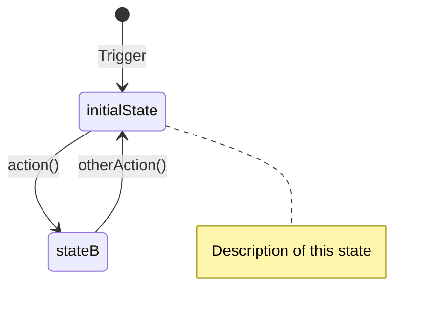

# State Machine Audit Template

> Use this template to create comprehensive state machine documentation for any codebase.
> This forces systematic mapping of ALL paths, not just happy paths.

## How to Use

Ask Claude:
```
Create state machine diagrams for this codebase using the 13-section audit template
```

Or more specifically:
```
Map out all state machines in [ComponentName] with full audit documentation
```

---

## Template Structure

### Section 1: Component State Diagram



### Section 2: State Details

| State | Key Properties | Effect |
|-------|----------------|--------|
| `initialState` | prop = value | What happens in this state |
| `stateB` | prop = other | What happens here |

### Section 3: Transitions

| From | To | Trigger | Guards |
|------|-----|---------|--------|
| `initialState` | `stateB` | `action()` | `guard == true` |
| `stateB` | `initialState` | `otherAction()` | None |

### Section 4: Sub-State Machines

(If component has multiple concerns, add separate diagrams)

### Section 5: Service Dependencies

```
┌─────────────┐
│  Component  │
└──────┬──────┘
       │
       ▼
┌─────────────┐
│  Dependency │
└─────────────┘
```

### Section 6: Concurrency Model

#### Thread Isolation

| Component | Isolation | Rationale |
|-----------|-----------|-----------|
| `ComponentA` | `@MainActor` | UI operations |
| `ServiceB` | `actor` | Shared mutable state |

#### Task Lifecycle

| Task | Owner | Cancellation | Cleanup |
|------|-------|--------------|---------|
| `taskName` | Component | When/how cancelled | What happens |

#### Race Condition Mitigations

| Race | Scenario | Mitigation |
|------|----------|------------|
| Name | What could race | How it's prevented |

### Section 7: Error Handling Matrix

| Operation | Error Condition | Handling | User Impact |
|-----------|-----------------|----------|-------------|
| `method()` | What can fail | How handled | What user sees |

### Section 8: Notifications (Events)

#### Sent

| Notification | Sender | When | Payload |
|--------------|--------|------|---------|
| `Event.name` | Component | Trigger | Data |

#### Received

| Notification | Listener | Source | Action |
|--------------|----------|--------|--------|
| `Event.name` | Component | Where from | What happens |

### Section 9: External System API Calls

| API | Used In | Purpose | Can Fail |
|-----|---------|---------|----------|
| `SystemAPI()` | Component | Why called | Yes/No |

### Section 10: Entry/Exit Actions

| State | On Enter | On Exit |
|-------|----------|---------|
| `stateA` | What runs | What runs |

### Section 11: Invariants

| Invariant | Enforced By | Violation Impact |
|-----------|-------------|------------------|
| "X must always be Y" | Guard/check | What breaks |

### Section 12: Security Considerations

| Concern | Mitigation | Notes |
|---------|------------|-------|
| Attack vector | How prevented | Context |

### Section 13: Test Coverage Checklist

#### State Transitions to Test
- [ ] State A → State B → State A cycle
- [ ] Rapid toggling (guard behavior)
- [ ] Timer-based transitions

#### Edge Cases to Test
- [ ] Error during transition
- [ ] External dependency unavailable
- [ ] Concurrent access

---

## Key Insights

1. **State diagrams show happy paths** - Auditors need error paths, races, and invariants
2. **Forces completeness** - The 13 sections ensure nothing is missed
3. **Actionable output** - Test checklist can become actual test cases
4. **Living documentation** - Update when code changes

## Example Output

See: `SaneBar/docs/state-machines.md` (670 lines covering 5 components)
